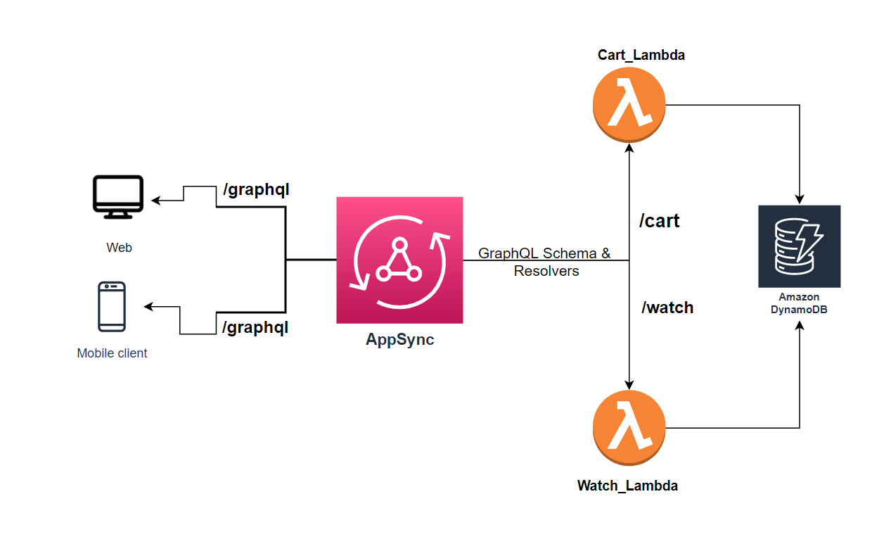

### Created Using Serverless Framework.

This is the backend part for the Project - WatchCart. you could checkout the refernece for frontend [here](https://github.com/LENO-DEV/React_AppSync).

#### Architecture Flow:

  

##### Technology Used:
- Serverless Framework
- GraphQL
- AWS AppSync
- DynamoDB
- Lambda
- Nodejs
